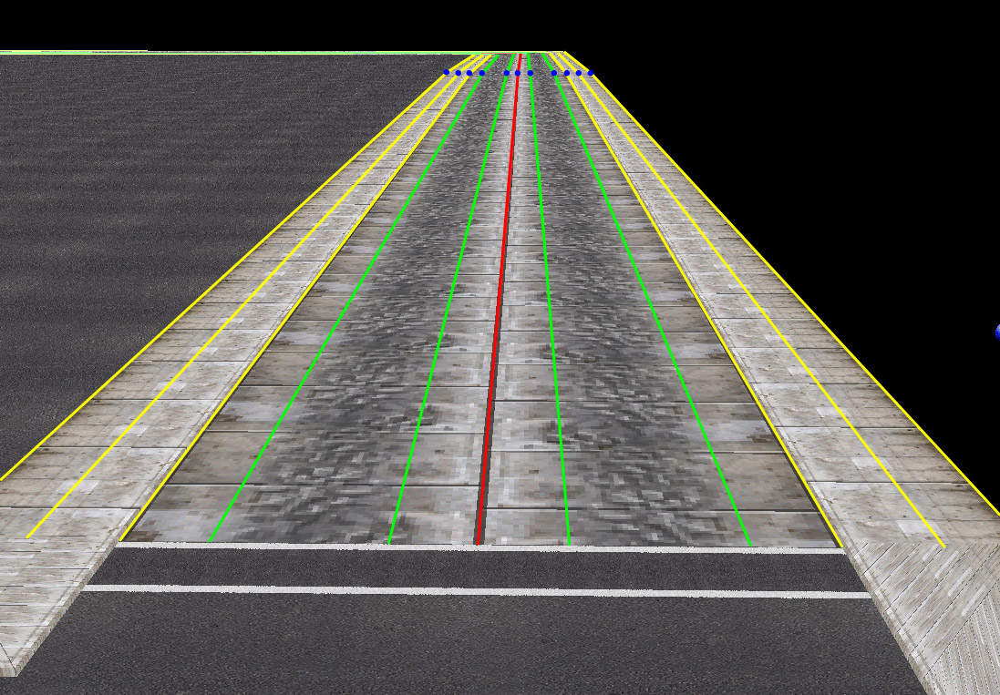

## Introduction

Each city may have one BAI-file. This file defines paths for controlling
ambients such as pedestrians and automated traffic.

## Format description

A BAI-file is built up in three sections. One section describes the
routes, or roads, that are available for pedestrians and ambient
traffic. One section describes the rooms where roads intersect and
where pedestrians and ambient traffic are presented with a choice to
select which road to take next. The last part of the BAI-file controls
what roads are active for computations of pedestrians and ambient
traffic.

### Roads

 The first section defines all the
routes that pedestrians and ambient traffic can travel along. The
routes, or roads, are defined by listing the [PSDL](PSDL.md)
rooms they pass through as well as several control curves defining
lanes for pedestrians, cars, trams and trains.


### Intersections

After the routes, all intersections are defined. This is done by
informing MM2 of what [PSDL](PSDL.md) room the intersection is
located on and what roads are connected to this intersection.

### Culling

The last part of the BAI-file lists the roads to compute ambients for
depending on the given [PSDL](PSDL.md) room id. This section is
divided into two parts, one for large AI-bubbles and one for small. Each
part gives one list of road indices that are to be active for each room
of the PSDL. Active means that AI computations are performed for the
roads listed for the room that the player is currently on. The first
list in each part should be ignored and thus set to a length of zero.

### Structure

In a pseudo-C style structure, a BAI-file looks like this:

```C
struct BAI
{
    char[4]         header = "CAI1";
    unsigned short  nIntersections;                 // Number of intersections
    unsigned short  nRoads;                         // Number of roads
    Road            roads[nRoads];                  // Roads
    Intersection    intersections[nIntersections];  // Intersections
    Culling         culling;                        // AI culling ("bubbles")
};
```

```C
struct Road
{
    unsigned short id;
    unsigned short nSections;       // Number of vertex sets
    unsigned short flags;           // See below
    unsigned short nRooms;          // Number of room references
    unsigned short rooms[nRooms];   // References to the SDL
    float          baseSpeed;        // The base speed for vehicles travelling on this road (base because vehicles get additional speed on freeways)
                                     // Note that Midtown Madness 2 at least will override this completely with the values defined in the race aimap file
    float          halfWidth;        // The width of half of the road

    RoadData       right;           // Data for right side
    RoadData       left;            // Data for left side

    float  distance[nSections];     // Distances between centre points of the road
    Vertex origin[nSections];       // Coordsys for tangent, origin
    Vector xOrientation[nSections]; // Coordsys for tangent, X axis
    Vector yOrientation[nSections]; // Coordsys for tangent, Y axis
    Vector zOrientation[nSections]; // Coordsys for tangent, Z axis
    Vector tangent[nSections];      // Direction of the road at each cross-section

    RoadEnd        end;             // End of the road
    RoadEnd        start;           // Start of the road
`};
```

```C
struct Intersection
{
    unsigned short id;
    unsigned short room;          // Reference to the SDL, (index + 1)
    Vertex         center;        // Center point of intersection
    unsigned short nRoads;        // Number of connected roads
    unsigned long  roads[nRoads]; // Counterclockwise ordered references to roads connected to this intersection
};
```

```C
struct Culling
{
    unsigned long  nRooms;         // Number of rooms in the SDL + 1
    CullingList    cull0[nRooms];  // Large AI bubbles
    CullingList    cull1[nRooms];  // Small AI bubbles
};
```

```C
struct CullingList
{
    unsigned short nRoads;
    unsigned short roads[nRoads];  // References to roads
}
```

```C
struct RoadData
{
    unsigned short nLanes;        // Number of lanes
    unsigned short nTrams;        // Number of tram rails (bool?)
    unsigned short nTrains;       // Number of train rails (bool?)
    unsigned short nSidewalks;      // Sidewalk? Always == 1 (bool?)
    unsigned short ambientTypes;      // Type of ambients allowed on this side of the road (see below)

    float  distance[nLanes+nSidewalks]                    // Outer edge distance
    float  lanesDistances[nLanes+nSidewalks][nSections];  // Distances between lane vertices
    char miscData[40];                                    // An interesting set of data (todo:document)
    Vertex lLanesVertices[nLanes+nSidewalks][nSections];  // Vertices for driving lane splines
    Vertex tramVertices[nTrams][nSections];               // Vertices for tram rail splines
    Vertex trainVertices[nTrains][nSections];             // Vertices for train rail splines
    Vertex sidewalkInner[nSections];                      // Vertices for sidewalk inner spline
    Vertex sidewalkOuter[nSections];                      // Vertices for sidewalk outer spline
};
```

```C
struct RoadEnd
{
    unsigned long  intersectionID;        // Reference to Intersection[].id
    unsigned short unknown0;              // Always 0xcdcd
    unsigned long  vehicleRule;           // See below
    unsigned long  intersectionRoadIndex; // Index in the intersections road list or 0xcdcdcdcd
    Vertex trafficLightOrigin;            // Origin of traffic light
    Vertex trafficLightAxis;              // Orientation of traffic light
};
```

```C
struct Vertex
{
    float x;
    float y;
    float z;
}

struct Vector
{
    float x;
    float y;
    float z;
}
```

Values for *Road.flags*:

  - 1 - Divided
  - 2 - Alleyway/Walkway
  - 4 - Freeway
  - 8 - Flat (Used to make traffic orientation checks cheaper with roads with just one constant slope)

Values for *RoadData.ambientTypes*:

  - 0 - Vehicles and pedestrians
  - 1 - Pedestrians only
  - 2 - Vehicles only
  - 3 - Nobody (disables all traffic)

Values for *RoadEnd.vehicleRule*:

  - 0 - Stop sign. The vehicles will stop, longest waiting vehicle
    drives first.
  - 1 - Traffic light. One road at a time. All roads connected to the
    same intersection must have this control type, if not, the vehicles
    will behave as if it was a stop sign and the traffic light will
    blink between green and yellow. Traffic lights will only show up if
    their coordinates are not (0, 0, 0).
  - 2 - Always stop. The vehicles stop and never proceed.
  - 3 - Never stop. The vehicles will drive straight through the
    intersection without even slowing down.
