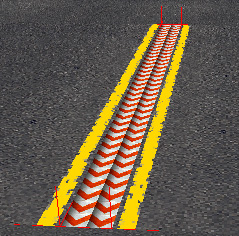
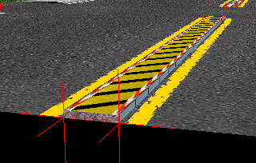
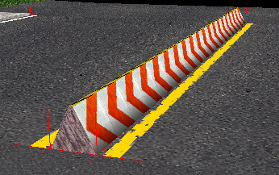
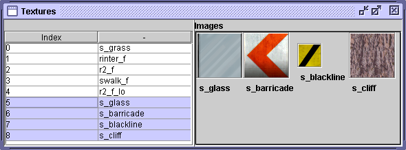

## Introduction

Most room attributes are built in a similar way, all share a bit
indicating that the attribute is the last one in the room, all have a
four bit type indicator and all have a three bit sub type indicator.
These parameters form the first byte of the first *ushort* of the
attribute data. The second byte is always zero.

| Bit | 15            | 14   | 13   | 12      | 11 | 10 | 9 | 8 | 7 | 6 | 5 | 4 | 3 | 2 | 1 | 0 |
| --- | ------------- | ---- | ---- | ------- | -- | -- | - | - | - | - | - | - | - | - | - | - |
|     | Reserved (=0) | Last | Type | Subtype |    |    |   |   |   |   |   |   |   |   |   |   |

Attribute type field

Typically, the subtype indicates the number of something for the
attribute, for example, the number of points in a triangle fan, the
number of cross-sections in a road and so on. The subtype zero usually
means that the counter is instead stored in the following uword in the
attribute data.

| Type                                        | Subtype | Description             |
| ------------------------------------------- | ------- | ----------------------- |
| [0x00](#Roads-with-sidewalks)    | n       | Road with sidewalks     |
| [0x01](#Sidewalk-strip)          | n       | Sidewalk strip          |
| [0x02](#Roads-without-sidewalks) | n       | Road without sidewalks  |
| [0x03](#Slivers)                 | 4       | Sliver                  |
| [0x04](#Crosswalk-rectangles)    | 4       | Crosswalk rectangle     |
| [0x05](#Road-triangle-fans)      | n       | Road triangle fan       |
| [0x06](#Triangle-fans)           | n       | Triangle fan            |
| [0x07](#Facade-bounds)           | 4       | Facade bound            |
| [0x08](#Divided-roads)           | n       | Divided road            |
| [0x09](#Road-tunnel/railing)     | 3       | Road tunnel/railing     |
| [0x09](#Junction-tunnel/railing) | 0       | Junction tunnel/railing |
| [0x0a](#Texture-references)      | n       | Texture reference       |
| [0x0b](#Facades)                 | 6       | Facade                  |
| [0x0c](#Roof-triangle-fans)      | n       | Roof triangle fan       |

Attribute types

## Common attributes

Most attributes of the PSDL-file are specialized, created for a specific
purpose. Some, however, are general attributes with several uses. This
section describes them.

### Texture references

Most geometry primitives use texture mappings. The textures are
identified by attributes of type *0xa*. The data is just one byte and a
padding zero byte. The byte is an eight bit index in the list of
materials. In order to be able to use more than 256 textures, the
subtype indicates a value to add to the byte to get the real index. This
formula can be used to compute the real index, *n*: *n* = *data* + (256
\* *subtype*) - 1. The data value 0 in subtype 0 is special, it prevents
rendering and collision on attributes that use it. Several room
attributes use more than one texture. In most cases the texture
attribute references the first texture in a list. This texture index is
referenced to as texture *n* and room attributes sometimes uses texture
index *n*, *n + 1*, *n + 2*, *n + 3* and so on.

In a pseudo-C style structure, the texture attributes look like this:

```
struct TextureReference
{
    bit    lastAttribute;
    bit[4] type = 0x0a;
    bit[3] subtype;
    bit[8] padding = 0x00;
    ushort data;
}
```

### Triangle fans

 To create ground surfaces triangle fans
are usually used. These are constructed by a list of vertices
surrounding a pivot vertex in a counter-clockwise order. Often the
triangle fan is degenerated to a convex polygon. This means that the
pivot vertex is located on the perimeter of the attribute.

Triangle fan attributes have type *0x06* and the sub type indicates the
number of triangles present in the triangle fan. Sub type zero is
special and means that the total number of *vertices* are stored in the
following uword. Of course, there are no actual coordinates listed in
the attribute, instead each uword in the data is an index in the vertex
list of the PSDL file.

```
struct TriangleFan
{
    bit                    lastAttribute;
    bit[4]                 type = 0x06;
    bit[3]                 subtype = 0x00;
    bit[8]                 padding = 0x00;
    ushort                 nTriangles; 
    ushort[nTriangles + 2] vertexRefs; // Indices in the vertex list
}
```

```
struct TriangleFan
{
    bit                 lastAttribute;
    bit[4]              type = 0x06;
    bit[3]              subtype != 0x00;
    bit[8]              padding = 0x00;
    ushort[subtype + 2] vertexRefs; // Indices in the vertex list
}
```

## Roads
In a racing game, the roads are one of the most important features.
There are several geometric primitives for defining roads, this section
describes them.

### Roads without sidewalks

 For walkways and narrow alleys without
sidewalks the attributes with id 0x02 is used. The data in the attribute
defines the road by pairs of vertices - cross sections of the road. The
sub type defines the number of cross sections the road consists of. If
the sub type is zero, the following ushort gives the number of cross
sections.

```
struct Walkway
{
    bit                   lastAttribute;
    bit[4]                type = 0x02;
    bit[3]                subtype = 0x00;
    bit[8]                padding = 0x00;
    ushort                nSections;  // Number of cross sections
    ushort[nSections * 2] vertexRefs; // Indices in the vertex list
}
```

```
struct Walkway
{
    bit                 lastAttribute;
    bit[4]              type = 0x02;
    bit[3]              subtype > 0x01;
    bit[8]              padding = 0x00;
    ushort[subtype * 2] vertexRefs; // Indices in the vertex list
}
```

### Roads with sidewalks

 The most common roads in an MM2 city are the
ones with sidewalks on both sides. These are easily defined using
cross-sections of the road. Attribute 0x00 defines cross sections of the
particular road segment.

The vertices in each cross section are organized like this: First comes
the vertex defining the position of the outer edge of the left sidewalk,
then follows the outer edge of the left road surface, the outer edge of
the right road surface and finally the outer edge of the right sidewalk.
MM2 automatically renders the vertical sides of the sidewalks and the
road surface vertices are expected to be located 0.15 units below the
sidewalk vertices.

This type of roads use three textures. The texture attribute points out
texture *n*, this texture is used to render the road surface. This
texture is mirrored along the center line of the road. The sidewalks are
rendered using texture *n* + 1 and texture *n* + 2 is the texture used
across the entire road in the lowest *LOD*, or level of detail, of the
road segment.

```
struct Road
{
    bit                   lastAttribute;
    bit[4]                type = 0x00;
    bit[3]                subtype = 0x00;
    bit[8]                padding = 0x00;
    ushort                nSections;  // Number of cross sections
    ushort[nSections * 4] vertexRefs; // Indices in the vertex list
}
```

```
struct Road
{
    bit                 lastAttribute;
    bit[4]              type = 0x00;
    bit[3]              subtype != 0x00;
    bit[8]              padding = 0x00;
    ushort[subtype * 4] vertexRefs; // Indices in the vertex list
}
```

### Divided roads

 The vertices in each cross section are
organized like this: First comes the vertex defining the position of the
outer edge of the left sidewalk, then follows the outer edge of the left
road surface, the inner edge of the left road surface, the inner edge of
the right road surface, the outer edge of the right road surface and
finally the outer edge of the right sidewalk. MM2 automatically renders
the vertical sides of the sidewalks and the road surface vertices are
expected to be located 0.15 units below the sidewalk vertices.

The road surface and sidewalks are rendered in the same way as the road
with sidewalk attributes.

#### Divider type

Several types of dividers can be created by using various parameters to
the divided road strip attributes. First we have a flags parameter, the
flags parameter is divided into two parts, it is currently not 100%
clear how many bits belong to which part, but the examined road
attributes in SF and London indicates that at least the two lowest bits
of the flags parameter is a divider type.

In addition to the flags parameter there is also an extra texture
reference and a value parameter. These are used differently depending on
the divider type.

  - 0 - Invisible: No divider is rendered, but the bound is there.
  
  - 1 - Flat: A flat divider is in the same height as the
    road surfaces, the *value* parameter defines how many times the
    texture is repeated across the divider.
    
   
    
   - 2 - Elevated: The *value* parameter specifies the height
    of the divider and the width of the side strips.
    
   
    
   - 3 - Wedged: A wedged divider is always one metre high.
    The top of the sloping sides are always 0.5 metres towards the
    center of the road from the given divider vertices. The remaining
    width between the two divider vertices are filled by a flat top
    strip.
    
   

#### Flags

Only two flags are known, besides the two type bits, those control the
closing of the short-ends of the divider. Bit seven closes the divider
at the start and bit eight closes the divider at the end. The first
section of a divided road should close it's start, the last section
should close it's end. Intermediary sections shouldn't close anything.

#### Textures

All dividers in these examples use the same textures as indicated in
this image:



The texture index, *n*, in this case *n* = 5, points to the texture used
for the sides of an elevated divider. *n* + 1 is used for a flat
divider, the sidestrips of an elevated divider and the sloping sides of
a wedge divider. Texture *n* + 2 is used for the center strip of an
elevated or wedge divider. Finally, texture *n* + 3 is used to close the
dividers.

```
struct DividedRoad
{
    bit                   lastAttribute;
    bit[4]                type = 0x08;
    bit[3]                subtype = 0x00;
    bit[8]                padding = 0x00;
    ushort                nSections;
    bit[5]                flags;
    bit[3]                dividerType;
    ubyte                 texture;    // Index in the texture list + 1 for the divider
    ushort                value;      // Usage depends on the divider type
    ushort[nSections * 6] vertexRefs; // Indices in the vertex list
}
```

```
struct DividedRoad
{
    bit                 lastAttribute;
    bit[4]              type = 0x08;
    bit[3]              subtype != 0x00;
    bit[8]              padding = 0x00;
    bit[5]              flags;
    bit[3]              dividerType;
    ubyte               texture;    // Index in the texture list + 1 for the divider
    ushort              value;      // Usage depends on the divider type
    ushort[subtype * 6] vertexRefs; // Indices in the vertex list
}
```

## Intersections

Where roads meet, some additional attributes are needed to make up the
geometry.

### Sidewalk strip

 A sidewalk strip defines a piece of a
sidewalk. The sidewalk is defined by a set of inner and outer vertex
indices, repeating a vertex index can be used to *bend* a sidewalk
around a point as shown in the image. The actual geometry will have an
additional point 0.15 units above the inner vertex of each cross
section.

#### Road end piece

 A special end piece for roads can be made
using sidewalk strip attribute *0xa*. Normally this attribute makes a
regular sidewalk strip with 4 vertices. However, if the first two vertex
references are both set to *0* or *1*, this attribute makes up a single
triangle begin piece or end piece respectively. Vertex references 3 and
4 define the two bottom vertices for the end piece. Another vertex is
generated 0.15 units above vertex 3 (vertex 1 in the picture) to form
the triangle.

```
struct SidewalkStrip
{
    bit                   lastAttribute;
    bit[4]                type = 0x01;
    bit[3]                subtype = 0x00;
    bit[8]                padding = 0x00;
    ushort                nSections;  // Number of cross-sections
    ushort[nSections * 2] vertexRefs; // Indices in the vertex list
}
```

```
struct SidewalkStrip
{
    bit                 lastAttribute;
    bit[4]              type = 0x01;
    bit[3]              subtype > 0x01;
    bit[8]              padding = 0x00;
    ushort[subtype * 2] vertexRefs; // Indices in the vertex list
}
```

### Crosswalk rectangles

A rectangular surface representing a cross-walk.

```
struct CrosswalkRectangle
{
    bit             lastAttribute;
    bit[4]          type = 0x04;
    bit[3]          subtype = 0x04;
    bit[8]          padding = 0x00;
    ushort[subtype] vertexRefs; // Indices in the vertex list
}
```

### Road triangle fans

A road triangle fan is encoded the same way as a regular triangle fan.

```
struct RoadTriangleFan
{
    bit                    lastAttribute;
    bit[4]                 type = 0x05;
    bit[3]                 subtype = 0x00;
    bit[8]                 padding = 0x00;
    ushort                 nTriangles; // Number of triangles
    ushort[nTriangles + 2] vertexRefs; // Indices in the vertex list
}
```

```
struct RoadTriangleFan
{
    bit                 lastAttribute;
    bit[4]              type = 0x05;
    bit[3]              subtype != 0x00;
    bit[8]              padding = 0x00;
    ushort[subtype + 2] vertexRefs; // Indices in the vertex list
}
```

## Buildings

Most of the buildings in a city is constructed using PSDL attributes.
These are well suited for low detailed buildings. For higher detail
levels, add [INST](INST "wikilink")-placed PKGs as parts of or complete
buildings.

### Roof triangle fans

The roof of a building is made up of triangle fans. These fans differ
from the regular triangle fan in that the vertex count is indicated
differently. Another difference is that they include a reference to a
height value that will replace the y-component of each of the referenced
points.

```
struct RoofTriangleFan
{
    bit                   lastAttribute;
    bit[4]                type = 0x0c;
    bit[3]                subtype = 0x00;
    bit[8]                padding = 0x00;
    ushort                nVertices;  // Number of vertices - 1
    ushort                heightRef;  // Index in the height list
    ushort[nVertices + 1] vertexRefs; // Indices in the vertex list
}
```

```
struct RoofTriangleFan
{
    bit                 lastAttribute;
    bit[4]              type = 0x0c;
    bit[3]              subtype > 0x01;
    bit[8]              padding = 0x00;
    ushort              heightRef;  // Index in the height list
    ushort[subtype + 1] vertexRefs; // Indices in the vertex list
}
```

### Facade bounds

To simplify collision detection, each facade has a single quad bound
surface. When facades are divided into several sections with different
texture maps, it is not necessary to check for collisions against every
subdivision since they are all covered by a single quad. Checking
against this quad is sufficient. The quad is constructed by taking the
two given vertices as the bottom side of the quad and then substituting
the y-component in these vertices to construct the corresponding
vertices at the top of the quad. This means that the top of a facade
bound is always perfectly horizontal, but this is also the case for the
facades and the roofs. The bottom edge of the facade bound can, however,
be slanted. This acommodates the possibility of a sliver on the facade.

```
struct FacadeBound
{
    bit    lastAttribute;
    bit[4] type = 0x07;
    bit[3] subtype = 0x04;
    bit[8] padding = 0x00;
    ushort angle; // Angle between 0-255 determines the angle
                  // between the facade and the sunlight 
    ushort top;   // Index in the height list
    ushort left;  // Index in the vertex list
    ushort right; // Index in the vertex list
}
```

### Slivers


The ground floor of a building is often partially below street level. To
simulate this, there is an attribute that accepts different y-components
on the two bottom vertices. This means that the bottom edge of the
facade can be slanted so that it follows the street outside the
building. The top edge of the sliver is always horizontal, though.

A small remark about slivers is that the texture scale is in fact a
reference to the height list. Usually these values are very small (e.g.
0.25) and should not be interpreted as heights for buildings. The
algorithm that MM2 uses to calculate the texture coordinates for this
attribute is a bit tricky. The texture is uniformly scaled but in the
horizontal direction it is shrinked (or stretched) to fit the building.
The calculations of the U and V coordinates are shown in the image.

```
struct Sliver
{
    bit    lastAttribute;
    bit[4] type = 0x03;
    bit[3] subtype = 0x04;
    bit[8] padding = 0x00;
    ushort top;          // Index in the height list
    ushort textureScale; // Index in the height list
    ushort left;  // Index in the vertex list
    ushort right; // Index in the vertex list
}
```

### Facades

A regular facade is modelled as a rectangle that has a texture map
repeated a number of times over its surface. The facade rectangle is
always aligned with the world Y axis.

```
struct Facade
{
    bit    lastAttribute;
    bit[4] type = 0x0b;
    bit[3] subtype = 0x06;
    bit[8] padding = 0x00;
    ushort bottom;  // Index in the height list
    ushort top;     // Index in the height list
    ushort uRepeat; // Number of times to repeat the texture along its u-axis
    ushort vRepeat; // Number of times to repeat the texture along its v-axis
    ushort left;    // Index in the vertex list
    ushort right;   // Index in the vertex list
}
```

## Tunnels and railings

The 0x9 attribute family is used for rendering tunnels and railings in
MM2; subtype 3 being used for roads only and subtype 0 for all sorts of
rooms (mainly intersections).

Tunnels and railings use 6 textures, defined in the preceding [texture
attribute](#Texture_references "wikilink"):

1.  Left wall
2.  Right wall
3.  Ceiling
4.  Right outside/top thick wall
5.  Left outside/top thick wall
6.  Ground, facing down

Subtype 0 (junction tunnel/railing) ignores wall textures 2 and 4, and
instead uses 1 and 5 for all walls.

### Road tunnel/railing

This type of tunnel attribute applies to roads. The subtype indicates
the size of the attribute (number of shorts). The only common version of
this attribute is 0x4b (subtype *3*), as used in San Francisco and
London.

MM2 will render walls along any of the roads following this attribute.

```
struct RoadTunnel
{
    bit    lastAttribute;
    bit[4] type = 0x09;
    bit[3] subtype = 0x03;
    bit[8] padding = 0x00;
    
    bit    leftSide         // enables left side
    bit    rightSide        // enables right side
    bit    style            // railing = 0 or wall = 1
    bit    flatCeiling      // ignored if curved ceiling is used
    bit    closedStartLeft  // closes the start of the left wall
    bit    closedEndLeft    // closes the end of the left wall
    bit    closedStartRight // ...
    bit    closedEndRight
    
    bit    curvedCeiling    // subdivided ceiling
    bit    offsetStartLeft  // chamfers the start of the left wall
    bit    offsetEndLeft    // chamfers the end of the left wall
    bit    offsetStartRight // ...
    bit    offsetEndRight
    bit    curvedSides      // subdivided sides
    bit    culled           // disables outer faces if railings are used
    bit    unknown          // probably unused

    ushort height           // height in meters * 256
    ushort unknown          // unknown value present if subtype != 2
}
```

In the files of MM2 Beta 1, the PSDL file "banktest.psdl" was found,
which uses the attribute 0x4a (subtype *2*). As its subtype indicates,
this attribute is 2 bytes shorter than the version described above. This
might explain why there is a second (unused?) height value.

### Junction tunnel/railing

This type of tunnel attribute can be used for any type of room, but is
mainly used for intersections. It uses the same parameters for the
appearance of the tunnel as the version for roads. The only difference
is that this attribute allows more control over the visibility of the
walls. This is done in form of a bit array, each bit referencing to a
perimeter point of the PSDL room. For example, if the first bit is set
to *1*, MM2 will render a wall between perimeter point *n* and *0*. If
the second bit is set to *1*, a wall will be rendered between perimeter
point *0* and *1*, and so on. Often the array is padded with trailing
zeros to match the attribute's size, which is defined in the first
*ushort*.

```
struct TunnelJunction
{
    bit    lastAttribute;
    bit[4] type = 0x09;
    bit[3] subtype = 0x00;
    bit[8] padding = 0x00;
    
    ushort nSize;           // number of shorts
    
    bit    leftSide         // enables left side
    bit    rightSide        // enables right side
    bit    style            // railing = 0 or wall = 1
    bit    flatCeiling      // ignored if curved ceiling is used
    bit    closedStartLeft  // closes the start of the left wall
    bit    closedEndLeft    // closes the end of the left wall
    bit    closedStartRight // ...
    bit    closedEndRight
    
    bit    curvedCeiling    // subdivided ceiling
    bit    offsetStartLeft  // chamfers the start of the left wall
    bit    offsetEndLeft    // chamfers the end of the left wall
    bit    offsetStartRight // ...
    bit    offsetEndRight
    bit    curvedSides      // subdivided sides
    bit    culled           // disables outer faces if railings are used
    bit    unknown          // probably unused
    
    ushort height           // height in meters * 256
    ushort unknown          // unknown value present if subtype != 2
    
    short  unknown3         // controls something about the visibility of the ceiling (more bits?)
    
    ushort[nSize - 4] enabledWalls // Each bit is used to indicate the visibility of a wall
                                   // (see description above)
}
```
